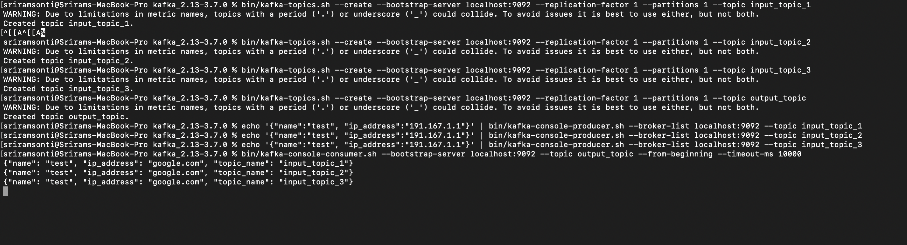
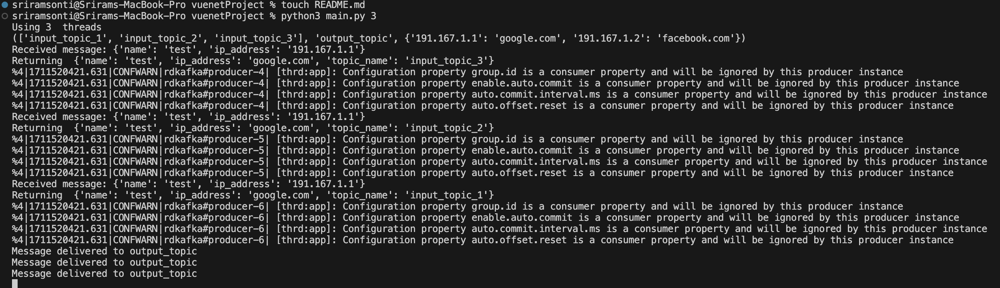

## Kafka Consumer-Producer Project

This Project is written in Python3.

Its core functionality is to poll a set of Kafka topics, perform the following processing steps and return the output to an output topic:

1. Flatten the message JSONs
2. Change IP Addresses to the hostnames mapped in `ip_mapping.yaml`
3. Add to the output message the input topic that particular message was received from

### Inputs

The main program takes in as the sole argument input the number of threads the program needs to run.

The `input.yaml` file should specify the following:
1. Kafka input topics to poll
2. Kafka output topic to write to
3. Path to `ip_mapping.yaml`

Meanwhile, `ip_mapping.yaml` should be of the following structure:
```
191.167.1.1: google.com
191.167.1.2: facebook.com
```

### How to Run

The program can be run with the following command:

```
python3 main.py <# max threads>
```

Please note that utils.py has a hard maximum number of threads, `HARD_LIMIT_MAX_THREADS`. If the number passed in from the command line exceeds the hardcoded maximum, the hardcoded maximum will be used.

If no max threads value is passed, the program will run single-threaded.

### Local Testing

In a Terminal tab run:

```
bin/zookeeper-server-start.sh config/zookeeper.properties
```

In another Terminal tab run:

```
bin/kafka-server-start.sh config/server.properties
```

This will bring up Zookeeper and Kafka.

Now in a third tab, first create the input and output topic(s):

```
bin/kafka-topics.sh --create --bootstrap-server localhost:9092 --replication-factor 1 --partitions 1 --topic input_topic_1

bin/kafka-topics.sh --create --bootstrap-server localhost:9092 --replication-factor 1 --partitions 1 --topic input_topic_2

bin/kafka-topics.sh --create --bootstrap-server localhost:9092 --replication-factor 1 --partitions 1 --topic input_topic_3

bin/kafka-topics.sh --create --bootstrap-server localhost:9092 --replication-factor 1 --partitions 1 --topic output_topic
```

Now, add messages to your input topics:

```
echo '{"name":"test", "ip_address":"191.167.1.1"}' | bin/kafka-console-producer.sh --broker-list localhost:9092 --topic input_topic_1
```

You can now run the python program:

```
python3 main.py <# max threads (optional)>
```

The output topic should have the right output. You can verify it by running:

```
bin/kafka-console-consumer.sh --bootstrap-server localhost:9092 --topic output_topic --from-beginning --timeout-ms 10000 
```

Here is what you should see from the Kafka side:



Here's what you should see as the program's console output:

